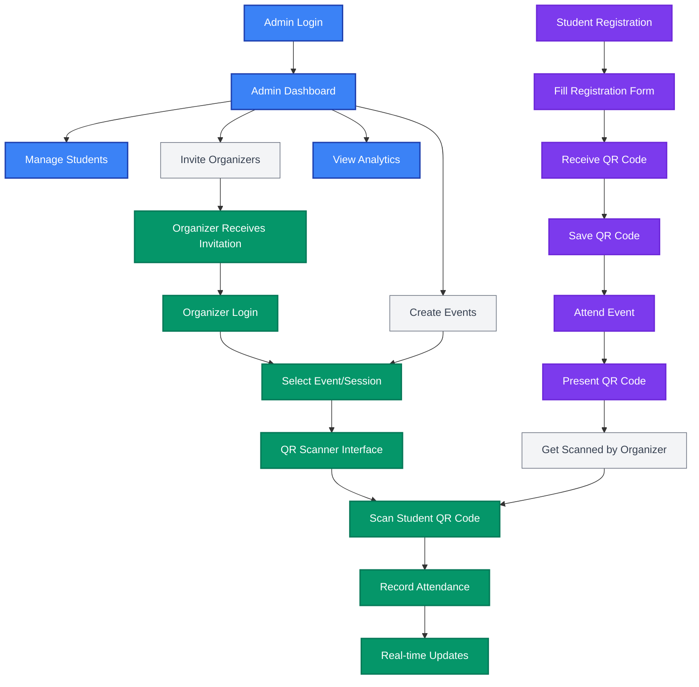

# DTP Go - Hybrid Student Registration System

DTP Go is a comprehensive attendance tracking and student registration system built with Next.js 15, TypeScript, and Tailwind CSS. The system supports two distinct registration workflows: secure admin-managed registration via a protected dashboard, and rapid self-registration by students during live events.

## 🎯 Project Overview

**Main Purpose**: DTP Go provides comprehensive attendance tracking and student registration for educational events

**Problem Solved**: DTP Go streamlines event attendance management by providing a one-time student registration system with QR code-based attendance tracking for multiple events

**Target Audience**: 
- **Administrators**: Manage students, events, organizers, and view analytics
- **Organizers**: Scan student QR codes for attendance tracking at events
- **Students**: Register once to receive a permanent QR code that works for all future events

### 📱 Application Screenshots

*Screenshots and GIFs showcasing the different user interfaces:*

#### Admin Dashboard


#### Organizer Scanning Interface


#### Student Registration


#### QR Code Display


## ✨ Core Features

- **One-Time Student Registration**: Students register once and receive a permanent QR code for all future events
- **Dual Registration Workflows**: Admin dashboard and public self-registration
- **QR Code Generation**: Static QR codes containing student IDs for attendance tracking
- **Real-time QR Scanning**: Organizers scan student QR codes using device cameras
- **Event & Session Management**: Create events with multiple attendance sessions and time windows
- **Organizer Management**: Invite and assign organizers to specific events
- **Analytics Dashboard**: Real-time registration metrics and attendance statistics
- **Role-based Authentication**: Secure Supabase Auth with Admin/Organizer permissions

## 🛠️ Technology Stack

- **Frontend**: Next.js 15 (App Router), React 19, TypeScript 5
- **Styling**: Tailwind CSS 4, shadcn/ui components, Lucide React icons
- **Database**: Supabase PostgreSQL with Prisma ORM
- **Authentication**: Supabase Auth with role-based access control
- **QR Code**: qrcode library for generation, html5-qrcode for scanning
- **Email**: Nodemailer for notifications
- **Validation**: Zod schemas for data validation

## 📋 Prerequisites

- Node.js 18+ and pnpm package manager
- Supabase account and project setup
- PostgreSQL database access
- Camera access for QR scanning functionality

## 🚀 Quick Start

### Environment Setup

Create a `.env.local` file in your project root:

```env
# =============================================================================
# DATABASE CONFIGURATION
# =============================================================================
# PostgreSQL Database Connection String
# Get this from: Supabase Dashboard > Settings > Database > Connection string > URI
DATABASE_URL=

# =============================================================================
# SUPABASE AUTHENTICATION
# =============================================================================
# Get these from: Supabase Dashboard > Settings > API

# Your Supabase project URL
NEXT_PUBLIC_SUPABASE_URL=

# Your Supabase anon/public key
NEXT_PUBLIC_SUPABASE_ANON_KEY=

# Optional: Supabase service role key (for admin operations)
SUPABASE_SERVICE_ROLE_KEY=

# =============================================================================
# EMAIL SERVICE (For future implementation)
# =============================================================================
SMTP_HOST=
SMTP_PORT=587
SMTP_SECURE=false
SMTP_USER=
SMTP_PASS=cylqbhnlazehbfxx
EMAIL_FROM=DTP Go <your@gmail.com>
EMAIL_REPLY_TO=youremail@gmail.com

# =============================================================================
# APPLICATION CONFIGURATION
# =============================================================================
NODE_ENV=development
NEXT_PUBLIC_APP_URL="http://localhost:3000"

ADMIN_EMAIL=""
ADMIN_PASSWORD=""
```

### Installation & Setup

1. **Install dependencies**:
   ```bash
   pnpm install
   ```

2. **Set up database**:
   ```bash
   # Generate Prisma client
   pnpm db:generate
   
   # Apply database migrations
   pnpm db:migrate
   ```

3. **Create admin user in Supabase**:
   - Go to your Supabase project dashboard
   - Navigate to Authentication > Users
   - Click "Add user" and create an admin account
   - Note the user's email address

4. **Set admin role in Supabase**:
   - Go to Supabase SQL Editor
   - Run the following SQL command to set admin role:
   ```sql
   UPDATE auth.users 
   SET raw_user_meta_data = jsonb_set(
     COALESCE(raw_user_meta_data, '{}'), 
     '{role}', 
     '"admin"'
   ) 
   WHERE email = 'your-admin-email@example.com';
   ```

5. **Start development server**:
   ```bash
   pnpm dev
   ```

6. **Open your browser**: [http://localhost:3000](http://localhost:3000)

## 📖 Basic Usage

### For Administrators
- Login at `/auth/login` → Access admin dashboard
- Manage students, events, and organizers
- View analytics and registration statistics

### For Organizers
- Login → Select event/session
- Scan student QR codes for attendance tracking
- Real-time attendance recording

### For Students
- Register once at `/join` → Receive permanent QR code
- Present QR code at any future event for attendance
- No need to re-register for each event

## 🔄 User Flow Diagram



## 📁 Project Structure

```
src/
├── app/                 # Next.js App Router
│   ├── admin/          # Admin dashboard pages
│   ├── organizer/      # Organizer scanning interface
│   ├── join/           # Public student registration
│   └── api/            # API routes
├── components/         # React components
│   ├── admin/          # Admin-specific components
│   ├── organizer/      # Organizer-specific components
│   └── ui/             # Reusable UI components
├── lib/                # Utilities and configurations
│   ├── auth/           # Authentication logic
│   ├── db/             # Database queries
│   ├── qr/             # QR code generation
│   └── scanning/       # QR scanning logic
└── prisma/             # Database schema
```

## 🛠️ Available Scripts

```bash
# Development
pnpm dev                # Start development server
pnpm build              # Build for production
pnpm start              # Start production server
pnpm lint               # Run ESLint

# Database Management
pnpm db:generate        # Generate Prisma client
pnpm db:migrate         # Run database migrations
pnpm db:studio          # Open Prisma Studio
pnpm db:reset           # Reset database

# Testing
pnpm test               # Run tests
pnpm test:watch         # Run tests in watch mode
pnpm test:coverage      # Run tests with coverage
```

## 🚀 Deployment

### Recommended Platform
- **Vercel**: Optimized for Next.js applications
- **Database**: Supabase PostgreSQL
- **Environment**: Set all required environment variables in deployment platform

### Deployment Steps
1. Connect your repository to Vercel
2. Configure environment variables
3. Deploy automatically on push to main branch

## 🤝 Contributing

- **Repository**: GitHub-based development
- **Issues**: Report bugs and feature requests through GitHub Issues
- **Documentation**: Comprehensive PRDs and task lists in `/docs` folder

## 📞 Support

For support and questions:
- Create an issue in the GitHub repository
- Check the documentation in the `/docs` folder
- Review the comprehensive PRDs for feature details

---

Built with ❤️ using Next.js 15, TypeScript, and Tailwind CSS